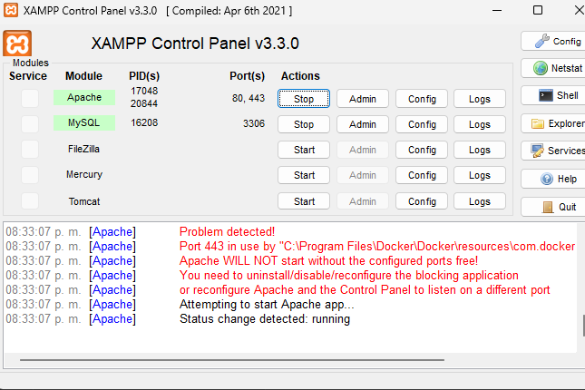
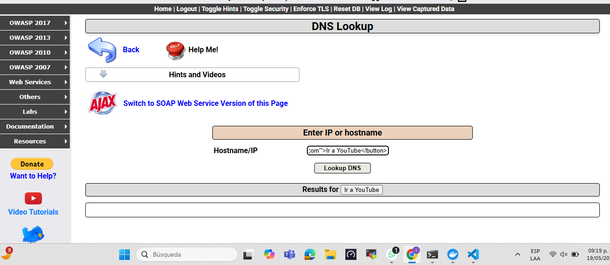

1. Registro de Usuario
Como paso inicial, se lleva a cabo el proceso de registro, mediante el cual el usuario genera sus credenciales de acceso (nombre de usuario y contraseña), que serán necesarias para autenticar su identidad en el sistema.

2. Inicio de Sesión y Captura de Datos
Una vez registrado, el usuario procede a realizar el inicio de sesión en la plataforma. Durante esta etapa, se lleva a cabo la captura y almacenamiento de los datos correspondientes del cliente, conforme a los parámetros establecidos por el sistema.

3. Modificación de Información del Cliente
Posteriormente, el sistema permite ejecutar la modificación de los datos previamente registrados del cliente, a través de la interfaz habilitada para dicho fin, garantizando la trazabilidad y consistencia de la información almacenada.

](image-2.png)
