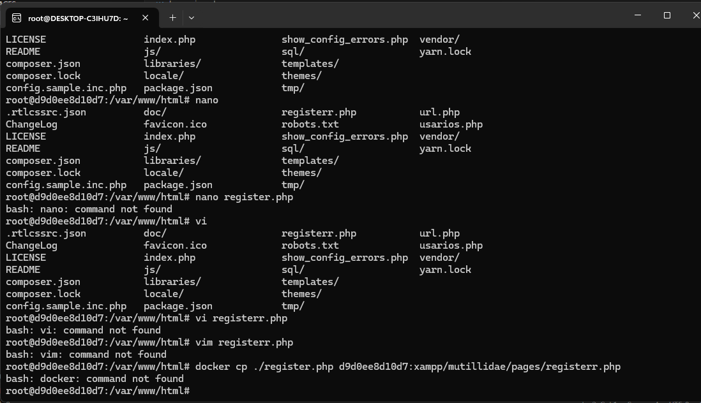

Se realiza una injection en una base de datos SQL se ingreso con "' or 1=1 -- ", colocando eso y cualquier contraseña el sistema me permitio ingresar como usuario admin. 

De igual manera se realizo reflected en la cual se hizo un boton que al dar click te redirije a youtube

Posterior a ello se hizo un script para que al momento de ingresar en el blog me proporcione la ubicacion por medio de coordenadas

Tambien use un script para ver cual es la IP publica: 

